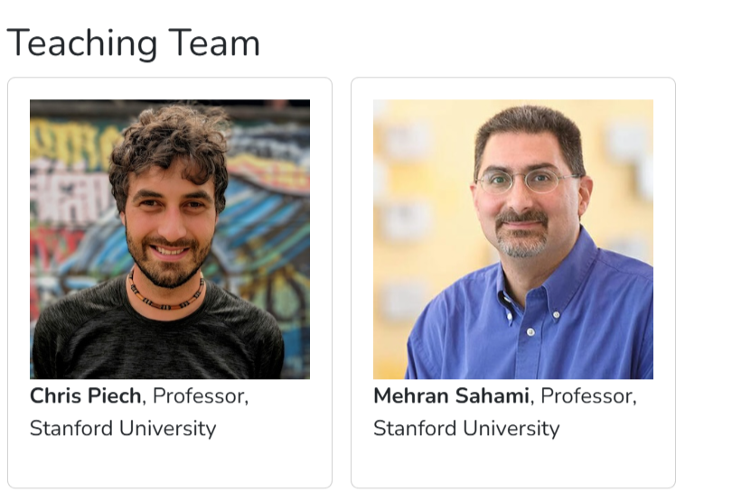
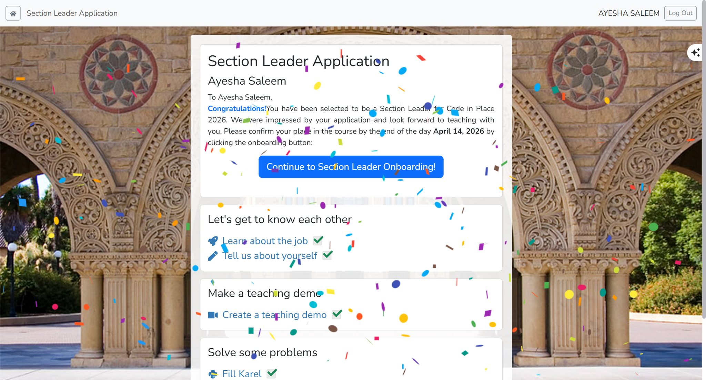
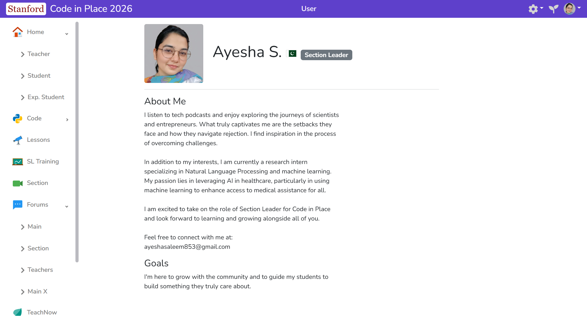
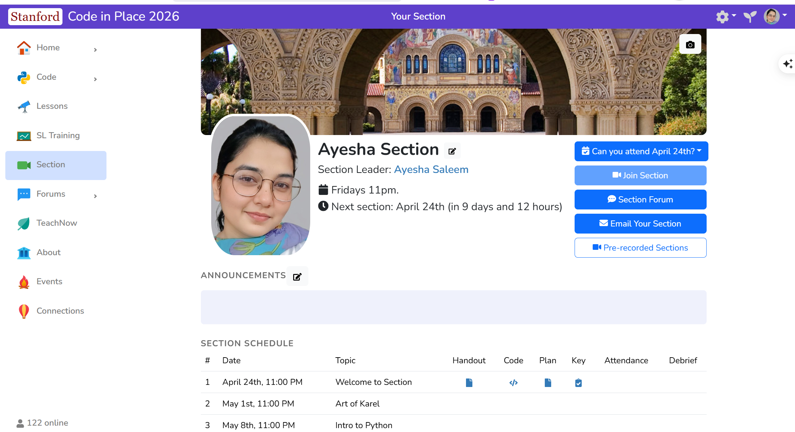
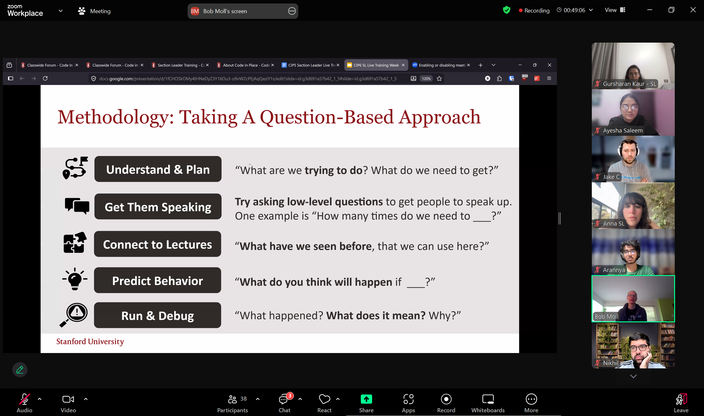
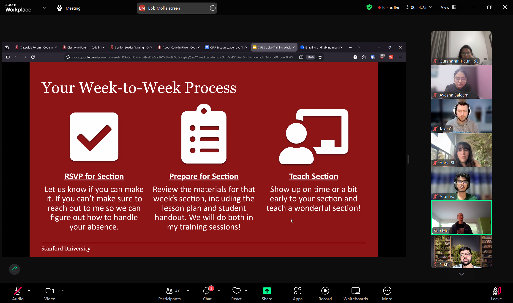
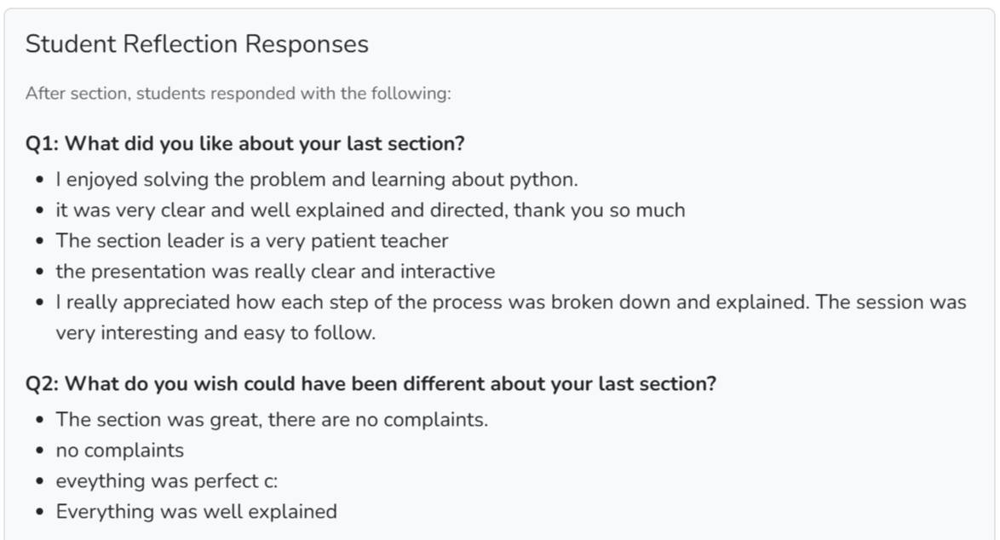
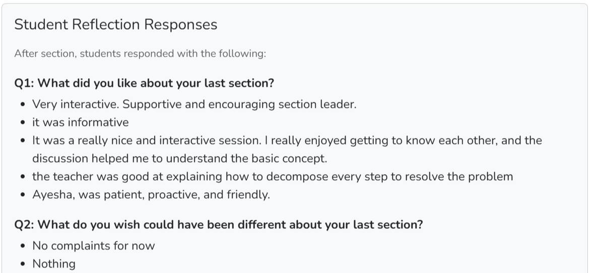
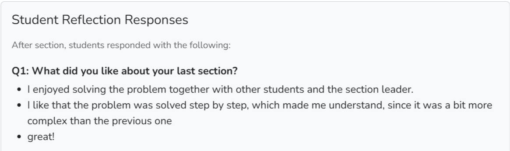

# Code in Place 2026

   

This repo is a visual scrapbook of my Stanford Code in Place 2026 Section Leader journey.

I wanted the README to feel like the experience itself: a little exciting, and a little personal.

[Code in Place](https://codeinplace.stanford.edu/) is Stanford’s free introductory programming course in Python. It is designed for complete beginners, focuses on learning by doing, and brings together students and section leaders from all over the world.

### Teaching team

Course faculty: Chris Piech & Mehran Sahami

> Welcome to Code in Place 2026.
>
> Congratulations Code in Place Community Member!
>
> We reviewed nearly two thousand section leader applications and we were impressed with your teaching.

That email landed on **Apr 12, 2026, 6:57 AM** and changed my whole Sunday. It was the moment the application stopped being a hope and became a real invitation to join the teaching team.

## At a glance

 **An official invitation to join Stanford Code in Place 2026**

 **A section leader journey built around teaching, training, and reflection**

 **Six weeks of real teaching across continents**

 **A personal milestone that meant even more because I am the first SL from Emerson University Multan**

## The story

### It started with the selection moment

That was the first big moment: seeing the application, the confetti, and the words that made it feel real.

The announcement meant a lot for a few reasons. Code in Place is Stanford University’s global CS education initiative, and this year nearly 2,000 applicants were reviewed for section leader spots. I’ll be teaching Python for six weeks, supporting students across the world, and stepping into a role with real responsibility.

> It also felt deeply personal because I became the **first student from [Emerson University Multan](https://eum.edu.pk/)** to be selected.

I’m grateful to my HOD Professor [DR. Sohail Raza](https://eum.edu.pk/faculty-profile/dr-sohail-raza/) for always backing us, and to Emerson University Multan for being the kind of place that lets you dream a little bigger.

### Then came the profile and the section space

|                                              |                                          |
| -------------------------------------------- | ---------------------------------------- |
|  |  |
| _Public profile_                             | _Section page_                           |

These are the spaces that made the role feel real. One is the personal side of the journey, and the other is the home base where section life comes together.

Seeing my profile and section page side by side made the responsibility feel visible. This was no longer just an application; it was an actual teaching home.

### The SL training and the rhythm of the week

|                                                                  |                                                                      |
| ---------------------------------------------------------------- | -------------------------------------------------------------------- |
|  |  |
| _Training and live discussion with Head TA Bob_                  | _Week-to-week process with Head TA Bob_                              |

The live training sessions were where the big ideas turned into something practical. I loved how the process was broken down into simple, teachable steps.

That is also what I admired most about the program itself. Code in Place is built around learning out loud, asking good questions, and helping students move through challenges one step at a time.

### And then the feedback came in

|                                                         |                                                         |
| ------------------------------------------------------- | ------------------------------------------------------- |
|  |  |
| _Student reflections_                                   | _Student reflections_                                   |

|                                                         |     |
| ------------------------------------------------------- | --- |
|  |     |
| _Student reflections_                                   |     |

These responses meant a lot. They were the quiet proof that clarity, patience, and a friendly pace really do make a difference.

The best part was seeing that students felt supported, understood, and comfortable enough to say the session was clear, interactive, and encouraging. That kind of feedback stays with you.

### Four weeks done

Four weeks into the role, the feeling has changed from "What did I sign up for?" to "I can do this, and I’m learning as I go." Teaching strangers, leading discussions, and answering questions is still challenging, but that is part of what makes it worth doing.

My students have come from: USA , India , the UK , Turkey , Palestine , and Peru . Teaching across continents makes the experience feel bigger than any single section. That is the real win.

The feedback captured that shift perfectly: patient, clear, supportive. No complaints. That hit different.

I am excited for week 5.

## A closing note

## From student to section leader — my experience

### Application

The journey began with an application that felt both exciting and daunting. I remember the moment I hit 'submit' and hoped for the best.

### Training

The training sessions were invaluable. They equipped me with the tools and confidence to lead effectively.

### Imposter syndrome

I often felt like an imposter, questioning my abilities. But with each session, I learned to embrace my role.

### Real talk

Teaching is not just about sharing knowledge; it's about connecting with students and understanding their struggles.

### Bottom line

This experience has been transformative, and I am grateful for the opportunity to grow alongside my students.

Sometimes the best opportunities come from the most unexpected places. Six months ago, I never would have imagined I’d be writing about becoming a Stanford Section Leader. But here we are, and I couldn’t be more hyped about what’s coming next.

Code in Place isn’t just about teaching Python, it’s about **opening doors, building confidence**, and showing people that technology isn’t some exclusive club. It’s for everyone, and I get to be part of making that happen.

> I joined from an email, but I stayed for the people, the responsibility, and the shared purpose.
